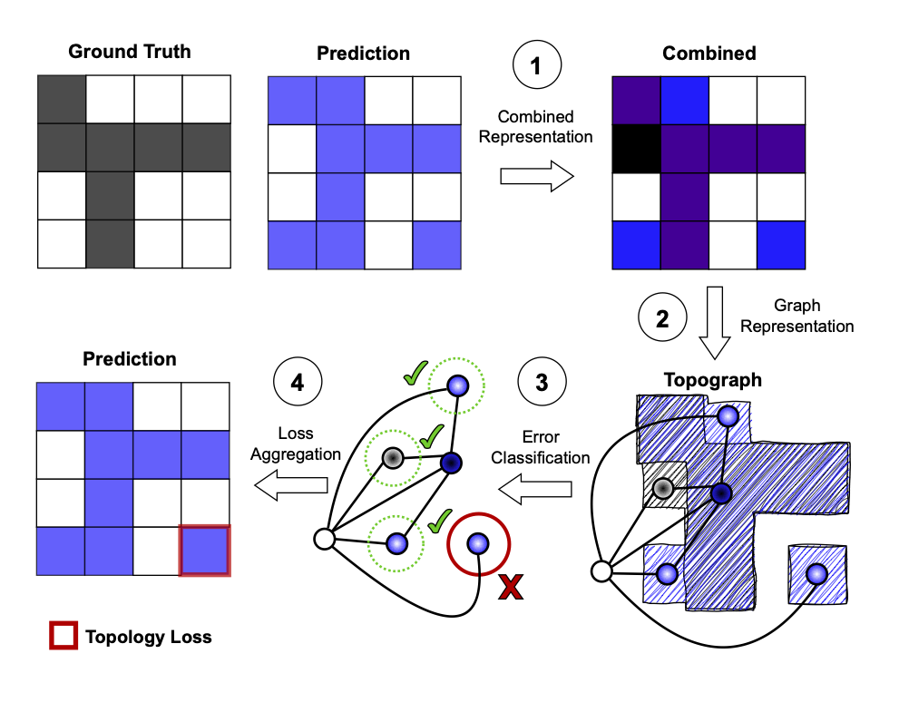
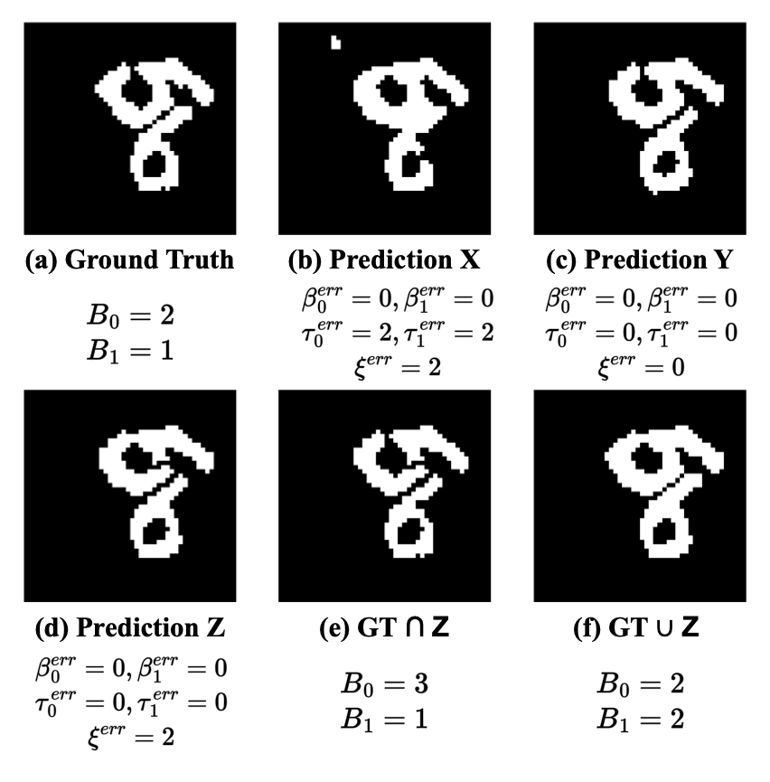
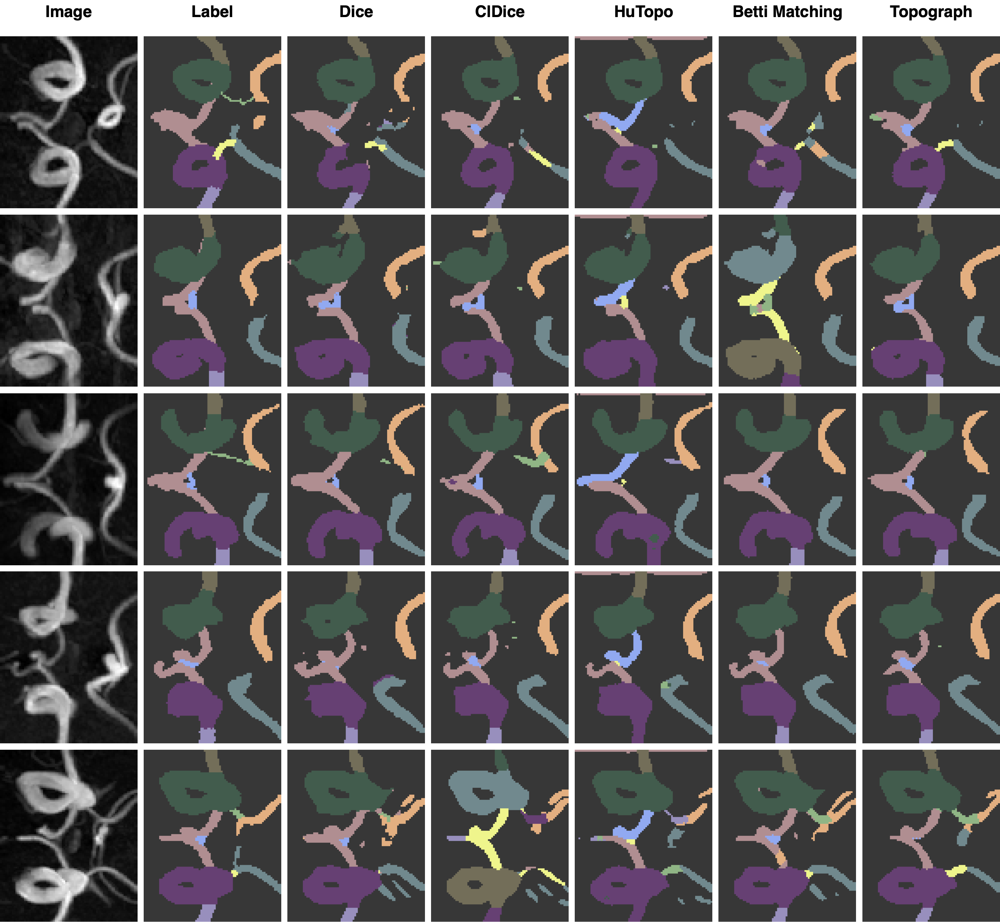

# Topograph: An efficient graph-based framework for strictly topology preserving image segmentation

This repository contains the implementation of **Topograph**, an efficient and general topology-preserving framework for image segmentation tasks. Leveraging the *combined region graph* $\mathcal{G}(P, G)$, this method provides topological guarantees beyond homotopoy equivalence of ground truth and segmentation with a low computational complexity of $O(n \cdot \alpha(n))$.

<div align="center">
  
</div>

## Overview
In segmentation and subsequent analysis tasks, ensuring topological correctness is often more critical than achieving marginal improvements in pixle-wise accuracy and Dice score. While pixel-losses, such as Dice-loss, provide guarantees for topological correctness for a zero loss, these guarantees are just a result of the required equivalence to the ground truth segmentation. Hence, there is no preference for correcting segmented regions that preserve topology compared to regions entirely irrelevant to topology.

<div align="center">
  
</div>

Starting from a binarized prediction our method builds a combined image by overlaying the ground truth segmentation to form a four-class image $C$. From this combined image $C$ a superpixel graph $\mathcal{G}(P, G)$ is constructed via connected component labeling, such that for the resulting graph $\mathcal{G}(P, G)$ each node represents one region and edges are determined based on spatial adjacency. 

Critical nodes representing incorrectly predicted regions causing topological errors can be identified in $\mathcal{G}(P, G)$ based on their local neighborhood. Formally, the set of critical nodes is defined by all wrongly predicted nodes that do not have exactly one correctly predicted foreground and one correctly predicted background neighbor. The final loss function is obtained by pixel-wise aggregation for each critical region.

Compared to existing work, this approach has several advantages: Our loss formulation:
1. surpasses existing methods in terms of topological correctness of the network’s predictions,
2. provides stricter topological guarantees than existing works, i.e. guarantees beyond the homotopy equivalence of ground truth and segmentation by enforcing homotopy equivalence to their union and intersection through the respective inclusion maps, capturing the spatial correspondence of their topological properties,
3. is time and resource-efficient because of its low $O(n \cdot \alpha(n))$ complexity and empirically low runtime,
4. and is flexible, making it applicable to arbitrary structures and image domains.

## DIU Metric
We propose a new metric that describes the Discrepancy between Intersection and Union (DIU) as a strict measure for topological accuracy. The metric is based on the linear map $i_{\*}: H_*(F_{\epsilon}(P) \cap F_{2\epsilon}(G)) \to H_{\*}(F_{\epsilon}(P) \cup F_{2\epsilon}(G))$ in homology (with coefficients in the field with two elements, $\mathbb F_2$) induced by the inclusion $i: F_{\epsilon}(P) \cap F_{2\epsilon}(G)) \to F_{\epsilon}(P) \cup F_{2\epsilon}(G)$ of the intersection into the union. 
Formally, $\xi^{err}$ is defined as

$\xi^{err} = \dim(\ker i_{\*}) + \dim(\mathop{\text{coker }} i_{\*})$.

By Alexander duality, this quantity can be expressed purely in terms of connected components (homology in degree $0$) of foreground and background.
Writing 
$j: B_{\epsilon}(P) \cap B_{2\epsilon}(G)) \to B_{\epsilon}(P) \cup B_{2\epsilon}(G)$ of the intersection of backgrounds into their union. 
We have

$\dim(\ker i_1) = \dim(\mathop{\text{coker }} j_0),\\
\dim(\mathop{\text{coker }} i_1)= \dim(\ker j_0).$

Thus, we have

$\xi^{err} = \dim(\ker i_0) + \dim(\mathop{\text{coker }} i_0)+\dim(\ker j_0) + \dim(\mathop{\text{coker }} j_0) .$


Intuitively, the DIU metric $\xi^{err}$ counts the number of components in the union that do not have a counterpart in the intersection ($`\dim(\mathop{\text{coker}})`$) and the surplus of intersection components that correspond to the same component in the union ($`\dim(\ker)`$). In the figure below (d) shows an example of cases where the Betti number error and the Betti matching error both fail to capture the semantic difference between ground truth and prediction.

<div align="center">
  
</div>

## Requirements
Our implementation requires just a few packages, which can quickly be installed:
```bash
pip install -r requirements.txt
```

## Implementation Topograph
**About the code**. We provide the source code of the **Topograph** method in this repository, together with an examplatory training script for easy reproducibility and comparison. The loss implementation can be found in [this file](losses/topograph.py) and can be easily integrated in any project:
```python
# Import the loss function
from losses.topograph import DiceTopographLoss
...
# Initialize
loss_function = DiceTopographLoss(
            softmax=True,
            num_processes=16,
            include_background=not config.DATA.INCLUDE_BACKGROUND,
            use_c=not args.no_c,
            eight_connectivity=config.LOSS.EIGHT_CONNECTIVITY,
            aggregation=AggregationType[getattr(config.LOSS, "AGGREGATION_TYPE", "mean").upper()],
            thres_distr=ThresholdDistribution[getattr(config.LOSS, "THRES_DISTR", "none").upper()],
            thres_var=getattr(config.LOSS, "THRES_VAR", 0.0),
        )
...
# Calculates the loss and returns information about components in dic
loss, dic = loss_function(outputs, labels, alpha=alpha)
```

## Implementation DIU metric

It is easy to use our implementation of the DIU metric (implemeted in [this file](metrics/topograph.py)):
```python
# Import the metric
from metrics.topograph import TopographMetric
...
# Initialize
diu_metric = TopographMetric(
            num_processes=16,
            ignore_background=not config.DATA.INCLUDE_BACKGROUND
        )

...
for img, label in dataloader:
    ...
    # DIU metric works with one-hot encoded predictions.
    # It may be required to preprocess your outputs.
    diu_metric(y_pred=one_hot_pred, y=label)
# aggregate scores
diu_score = diu_metric.aggregate().item()

# reset internal aggregation if metric should be used again (e.g. next epoch)
diu_metric.reset()
```

## Full training script
To reproduce our experiments we provide the complete [training script](./train.py). The parameters can be set in a seperate config file:
```bash
python train.py --config configs/cremi_config.yaml
```
Example config files that can be used right away can be found [here](configs/).

### Command-line arguments
For further customization (using a pretrained model or running a hyperparameter sweep) you can set several command-line arguments:
```bash
usage: train.py [-h] [--config CONFIG] [--pretrained PRETRAINED] [--resume RESUME] [--disable_wandb] [--folds FOLDS] [--fold_no FOLD_NO] [--sweep] [--log_train_images] [--no_c]

options:
  -h, --help            show this help message and exit
  --config CONFIG       config file (.yaml) containing the hyper-parameters for training and dataset specific info.
  --pretrained PRETRAINED
                        checkpoint of the pretrained model
  --resume RESUME       checkpoint of the last epoch of the model
  --disable_wandb       disable wandb logging
  --folds FOLDS         Number of folds for cross-validation
  --fold_no FOLD_NO     Which fold to use for training and validation
  --sweep               If the training is part of a sweep
  --log_train_images    Log training images to wandb
  --no_c                Whether to not use the efficient c implementation
```


## Full evaluation script
We provide a full-working [evaluation script](./evaluation.py) to evaluate a model on multiple metrics. The parameters can be set in a seperate config file:
```bash
python evaluation.py --config configs/cremi_config.yaml
```
```bash
usage: evaluation.py [-h] [--config CONFIG] [--model MODEL]

options:
  -h, --help       show this help message and exit
  --config CONFIG  config file (.yaml) containing the hyper-parameters for training and dataset specific info.
  --model MODEL    checkpoint of the pretrained model
```

## Results

Here are some results of the performance of Topograph compared to other methods (see full results in paper):

### Roads Dataset
| Method        | DIU ↓         | BM ↓          | B0 ↓          | B1 ↓          | Dice ↑        | clDice ↑      |
| ------------- | ------------- | ------------- | ------------- | ------------- | ------------- | ------------- |
| Dice          | 7.313 ± 0.613 | 6.615 ± 0.531 | 1.935 ± 0.417 | 2.642 ± 0.174 | 0.819 ± 0.003 | 0.720 ± 0.011 |
| clDice        | 7.127 ± 0.318 | 5.810 ± 0.286 | 1.515 ± 0.212 | 3.058 ± 0.142 | 0.803 ± 0.007 | 0.704 ± 0.012 |
| HuTopo        | 7.498 ± 0.743 | 6.356 ± 0.665 | 1.185 ± 0.617 | 2.683 ± 0.378 | 0.817 ± 0.004 | 0.714 ± 0.004 |
| BettiMatching | 6.733 ± 0.365 | 5.908 ± 0.234 | 0.942 ± 0.098 | 2.317 ± 0.080 | 0.818 ± 0.002 | 0.707 ± 0.012 |
| Mosin         | 7.221 ± 0.710 | 6.352 ± 0.640 | 1.523 ± 0.380 | 2.756 ± 0.110 | 0.816 ± 0.001 | 0.710 ± 0.010 |
| Ours          | 6.521 ± 0.470 | 5.635 ± 0.404 | 1.212 ± 0.247 | 2.619 ± 0.155 | 0.817 ± 0.002 | 0.711 ± 0.008 |

### TopCoW Dataset
| Method        | DIU ↓          | BM ↓         | B0 ↓         | B1 ↓         | Dice ↑       | clDice ↑     |
| ------------- | -------------- | ------------ | ------------ | ------------ | ------------ | ------------ |
| Dice          | 15.716 ± 1.61  | 0.977 ± 0.89 | 0.722 ± 0.07 | 0.073 ± 0.02 | 0.729 ± 0.01 | 0.773 ± 0.01 |
| clDice        | 10.670 ± 1.76  | 0.678 ± 0.13 | 0.483 ± 0.11 | 0.049 ± 0.01 | 0.733 ± 0.01 | 0.804 ± 0.02 |
| HuTopo        | 16.057 ± 6.67  | 0.992 ± 0.43 | 0.717 ± 0.33 | 0.092 ± 0.05 | 0.711 ± 0.04 | 0.758 ± 0.04 |
| BettiMatching | 12.352 ± 0.90  | 0.761 ± 0.06 | 0.556 ± 0.06 | 0.064 ± 0.01 | 0.740 ± 0.01 | 0.787 ± 0.01 |
| Mosin         | 23.534 ± 16.95 | 1.489 ± 0.98 | 1.128 ± 0.83 | 0.154 ± 0.07 | 0.606 ± 0.16 | 0.659 ± 0.17 |
| Ours          | 10.477 ± 1.35  | 0.658 ± 0.09 | 0.461 ± 0.06 | 0.052 ± 0.02 | 0.735 ± 0.01 | 0.801 ± 0.01 |


